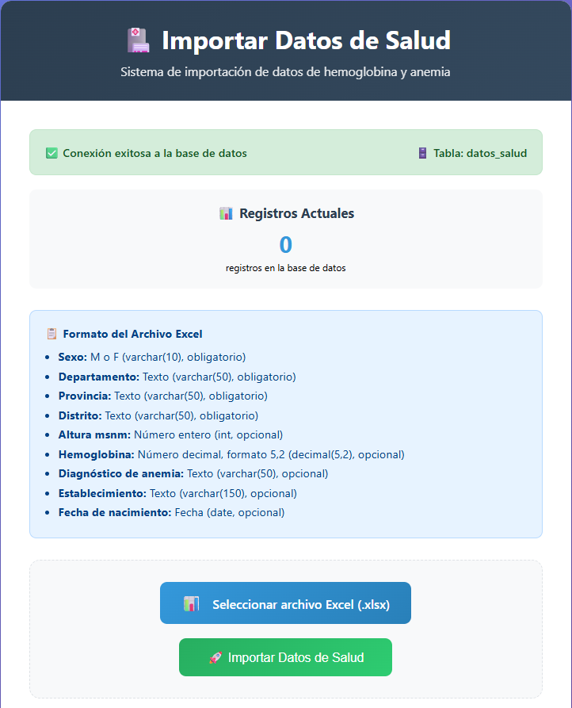
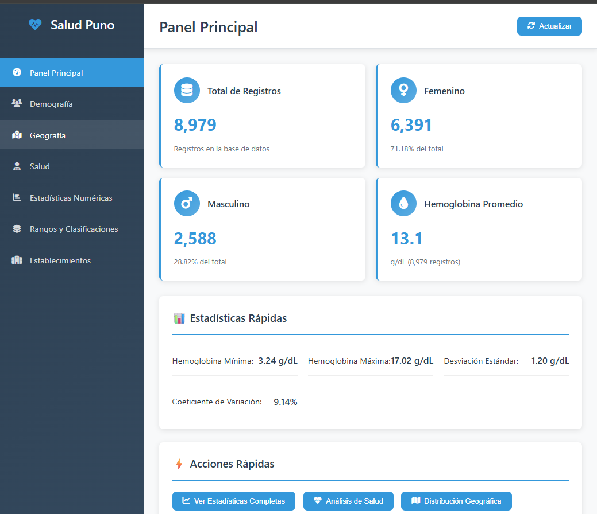
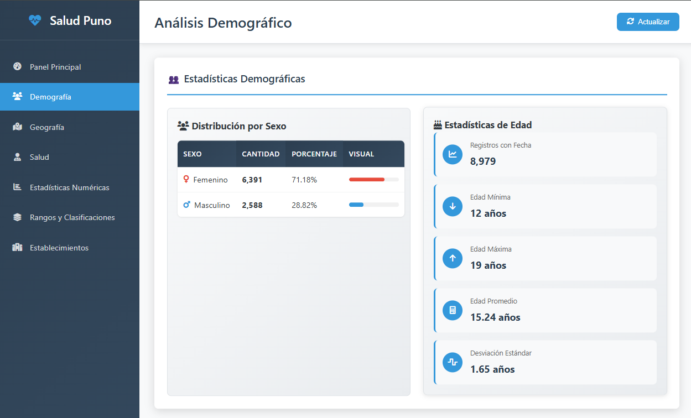
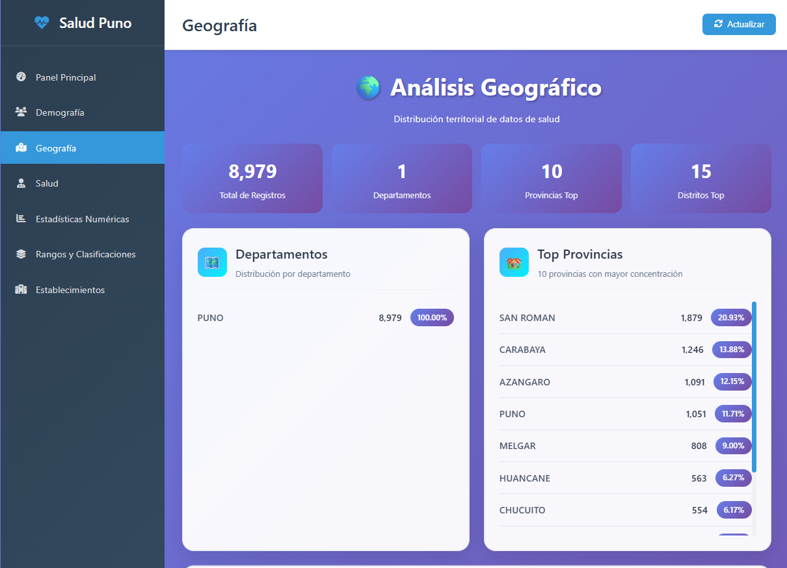

Anemia Tracker es un proyecto orientado al análisis de datos clínicos enfocados en la detección y seguimiento de la anemia en población vulnerable. Utiliza registros de hemoglobina, edad, sexo, altura y otros factores relevantes para generar información clave en el monitoreo de la salud pública.

Este repositorio contiene una estructura de base de datos SQL optimizada para almacenar y analizar datos médicos con enfoque en anemia infantil y poblacional.

## 🌐 Tecnologías utilizadas

  
  
  
  

## 📥 Importar Datos de Salud

Este módulo permite importar registros clínicos desde un archivo Excel (`.xlsx`) directamente a la base de datos del sistema. Es ideal para cargar grandes volúmenes de datos de forma automatizada y segura.

---## 📊 Tecnologías usadas en el proyecto
### Variables principales

| Campo               | Tipo de dato    | Obligatorio |
|---------------------|-----------------|-------------|
| Sexo                | varchar(10)     | ✅ Sí       |
| Departamento        | varchar(50)     | ✅ Sí       |
| Provincia           | varchar(50)     | ✅ Sí       |
| Distrito            | varchar(50)     | ✅ Sí       |
| Altura msnm         | int             | ✅ Sí       |
| Hemoglobina         | decimal(5,2)    | ✅ Sí       |
| Diagnóstico de anemia | varchar(50)   | ✅ Sí       |
| Establecimiento     | varchar(150)    | ✅ Sí       |
| Fecha de nacimiento | date            | ✅ Sí       |

### 🧩 Características

- ✅ **Conexión automática** con la base de datos
- 🗄️ **Tabla destino:** `datos_salud`
- 📊 **Visualización en tiempo real** de la cantidad de registros existentes
- 📋 **Validación del archivo Excel** antes de importarlo
- 🚀 **Carga instantánea** de datos clínicos con un solo clic
- 
- 
-------------------------------------------------------------------------------------------------------------------------------------------------------------------------------------------
📊 Visualizador de Datos de Salud de los peruanos.
Esta página web permite visualizar y explorar variables clave relacionadas con la anemia a partir de datos clínicos y demográficos. Facilita el análisis de información como sexo, ubicación geográfica, altura, niveles de hemoglobina y diagnósticos, para entender mejor la prevalencia y distribución de la anemia en distintas regiones.

Cada uno de estos directorios nos ayuda a analizar las variables.

## 👩‍💻 Desarrolladores

| Nombre Completo       | Rol                   | Contacto                      | Perfil GitHub                         |
|----------------------|-----------------------|-------------------------------|-------------------------------------|
| jayler machaca       | Desarrollador Backend  | jayler10jobs@gmail.com         |      |
|                      | Desarrolladora Frontend|                                |    |
|                      | Analista de Datos      |                                |           |

---
